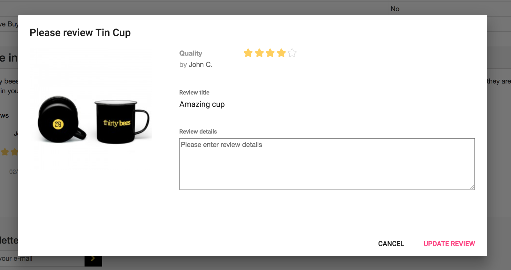
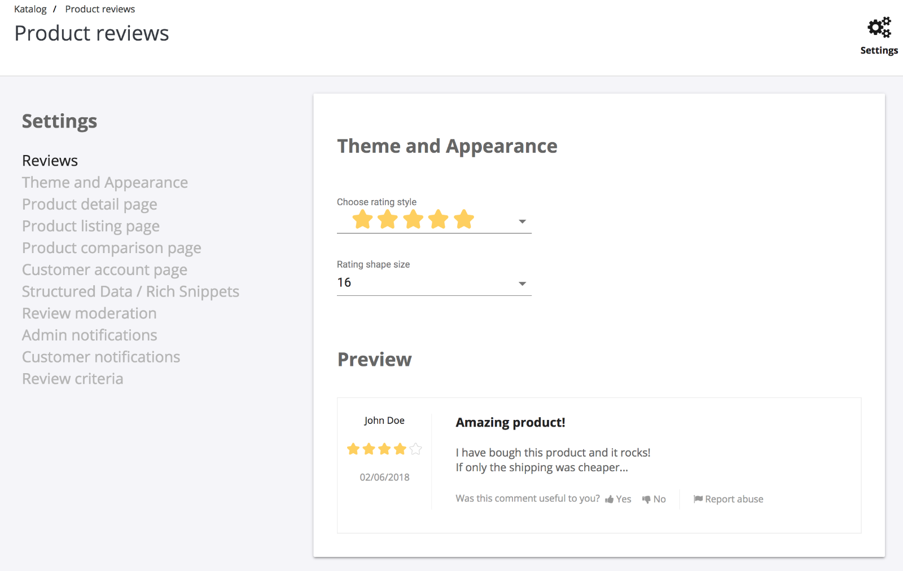
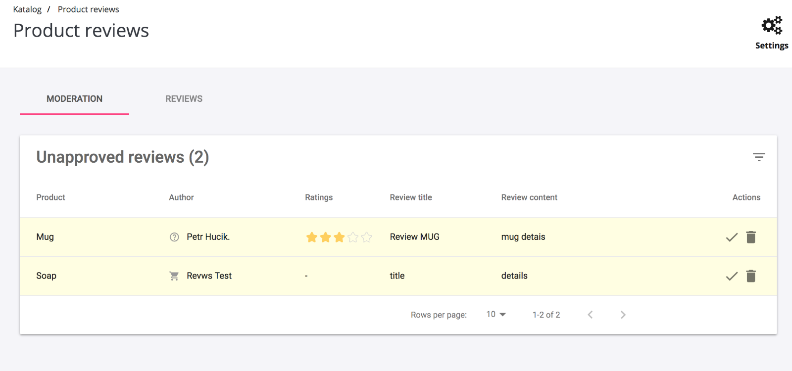
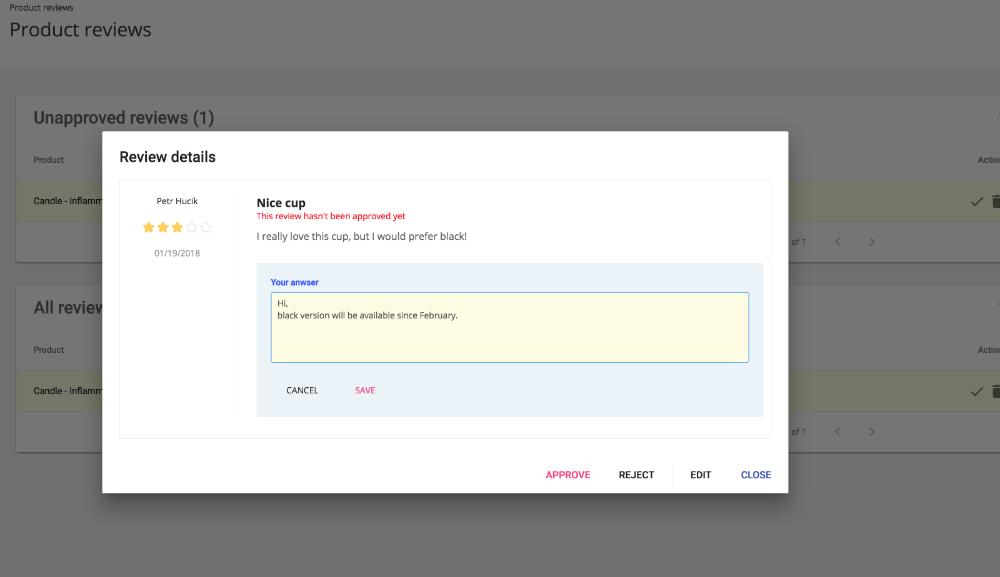
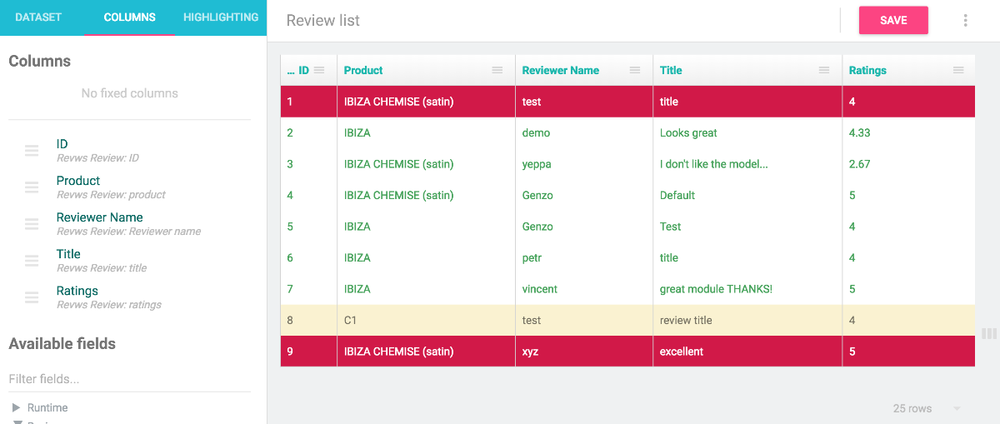

# Product Reviews

This is free review module for prestashop and thirtybees platform. Its goal is to
create the most user friendly way to create reviews on your website.

During module development I've very closely cooperated with actual [merchants](https://forum.thirtybees.com/topic/1235/i-m-going-to-create-a-free-module), so you can be sure this module covers the most common use cases.

## Features

- both customer and guest reviews
- review moderation by administration
- multiple review criteria
- theming options - you don't have to use standard star symbol anymore
- google structured data / rich snippets support
- customers can edit / delete their reviews
- voting and report abuse buttons
- review suggestions based on recent purchase
- comprehensive settings - you can tweak almost anything
- and much more

## Compatibility

- thirtybees 1.x.x
- prestashop 1.6.x.x
- prestashop 1.7.x.x

## Screenshots

## Accessing review data

This review module is integrated with [DataKick module](https://www.getdatakick.com/) - your review data will be available in lists, xml exports, you can use inline editing and mass updates functionality. You can even import your reviews. Minimal required version of datakick module is 2.1.0

## Development and contribution

This module is released under Academic Free License (AFL 3.0). You are welcome to fork this repository and adjust the code according to your needs.

This repository is NOT a valid prestashop module. You can't just upload it to your prestashop and expect it will work. Huge chunk of code is a [react.js](https://reactjs.org/) application that needs to be transpiled from es6 to standard javascript library.

Please follow instructions in [dev manual](dev.md).

## Author

Petr Hučík - [datakick](https://www.getdatakick.com)
